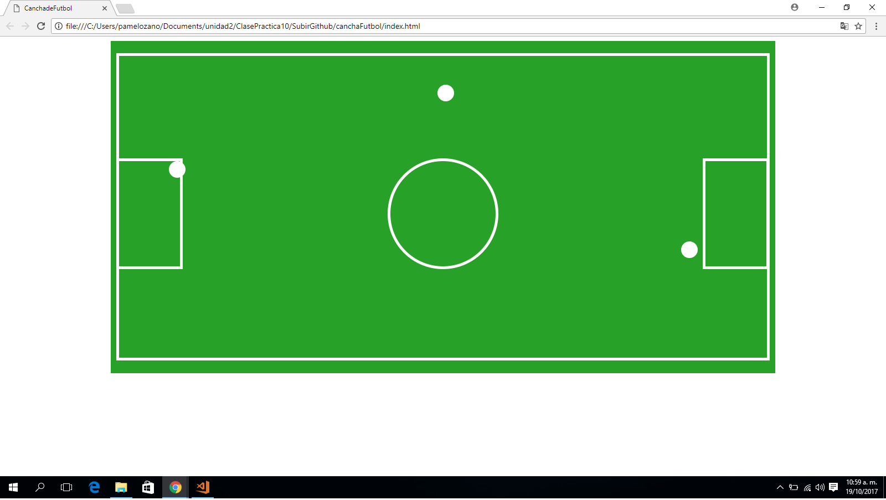

## CANCHA DE FÚTBOL

### POSITION ABSOLUTE Y STATIC
Este repositorio contiene un proyecto (cancha de futbol) trabajado  __**(position absolute y static)**__ ya poder alterar las posiciones de cada elemento como, el area, el circulo de centro, los arcos(derechae izquierda) y los balones(izquierda, centro y derecha) de la cancha de fútbol.

### Pondremos en práctica lo siguiente:
1. Aplicaremos **selectores:**
    * Selector universal: *
    * Selector de clases: atributo **class**

2. Aplicaremos __"elementos que componen el modelo de caja"__
    * Padding **(relleno)**.
    * Margin **(margen)**

3. Aplicaremos la __"propiedad de los elementos de caja""__
    * display **(por bloques)**
    * background-color **(Color al bloque)**

4. Aplicaremos __"Propiedad Positioning"__
    * static (No se modificara el elemento seguira el orden de la pagina)
    * absolute (Definimos la posicion usando propiedades(top, left, right))

5. Aplicaremos __*Propiedades de position absolute*__ para posicionar el orden de los balon, los arcos, el circulo del centro y el area de la cancha: 
    * top   **(superior)**
    * left  **(izquierda)**
    * right **(derecha)**

### Herramientas Utilizadas:
1. HTML
2. CSS3

### Imagen final:
